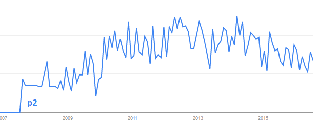
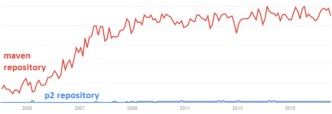
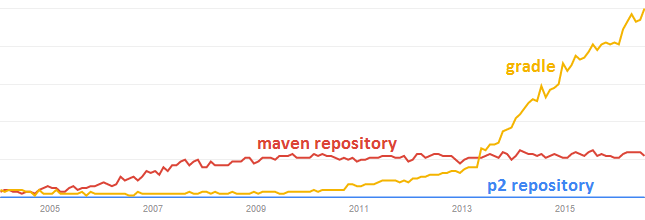

# P2, Maven, and Gradle

If you work with eclipse, then you know all about p2.  It's an ambitious piece of software with broad scope, and it gives the eclipse ecosystem several unique features (bundle pools!).  The downside of its ambition and scope is its complexity - it can be daunting for newcomers to use.  Based on google search traffic, let's see how many people are searching the term `p2 repository`:



It looks like, for now, p2 has reached its full audience.  To put the y-axis into perspective, let's compare the number of people searching for `p2 repository` with the number of people searching for `maven repository`.



This tells us two things:

1. If you publish software in a p2 repository, most of the java world doesn't know how to get it.
2. Unless some event happens, that's not going to change - the trends, such as they exist currently, are not in p2's favor.

The tragedy of this is that the eclipse ecosystem has [lots of valuable bits](https://github.com/diffplug/spotless) to offer the broader community, and the broader community has lots of valuable contributions that aren't happening because they just can't get our stuff in the first place.

If we were looking for a strategy to get eclipse and p2 into the hands of more users and potential contributors, where could we go?



For my money, the future of JVM build systems is Gradle.  Possibly even the future of build systems in general.  You can debate the merits, but the data shows that's where programmers are and where they're going (at least for the immediate future).

So, in an attempt to put Eclipse, p2, and its associated ecosystem onto the Gradle rocketship, I'm proud to present [Goomph](https://github.com/diffplug/goomph).  Goomph is a gradle plugin which can do two things:

1) Put a little snippet inside your `build.gradle` file, and it will provision your IDE as a disposable build artifact, using techniques stolen from Oomph.

```groovy
apply plugin: 'com.diffplug.gradle.oomph.ide'
oomphIde {
	repoEclipseLatest()
	jdt {}
	eclipseIni {
		vmargs('-Xmx2g')    // IDE can have up to 2 gigs of RAM
	}
	style {
		classicTheme()  // oldschool cool
		niceText()      // with nice fonts and visible whitespace
	}
}
```

2) It can download artifacts from a `p2` repository, run PDE build, run eclipse ant tasks, and all kinds of eclipse build system miscellany.

If you're curious about these claims, you can quickly find out more by cloning the [Gradle and Eclipse RCP](https://github.com/diffplug/gradle_and_eclipse_rcp) demo project.  Run `gradlew ide` and you'll have a working IDE with a targetplatform ready to go.  Run `gradlew assemble.all` and you'll have native launchers for win/mac/linux.

If you'd like to know more about Gradle and p2, [here's a youtube video](https://www.youtube.com/watch?v=PIC6YeRkRlo&feature=youtu.be) of a talk I presented at Gradle Summit 2016.

Future blog posts will dive deeper into these topics.  If you'd like to be notified, you can follow its development on any of these channels:

<!---freshmark follow
output = follow;
-->
[](https://github.com/nedtwigg/blog/subscription)
[](https://github.com/nedtwigg/blog/stargazers)
[](https://twitter.com/NedTwigg)
[](https://dev.to/nedtwigg)
[](https://dev.to/nedtwigg)
<!---freshmark /follow -->
