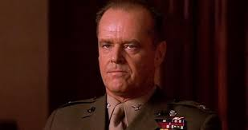

# version = f(changelog)

As a user, it's nice when a project has a changelog.  As a maintainer, it's a chore to keep the changelog up-to-date, and many maintainers don't.  Unfortunately, they can't opt-out from asking "Is this a big-enough change to justify a new major version?  Is this good enough for 1.0?"  But these two tasks are actually tightly coupled!

- **changelog**: what changed since the last version
- **version**: project these changes (and the absolute level of project quality) onto the three-dimensional vector space of non-negative integers `x.y.z`, path dependent on the previously published three-vector

That sounds silly, but it's not.  There are real cultural norms around what level of quality is required to call something `1.0`, what kind of a change is big enough to count as `2.0`, and how silly it would be to publish a `53.0`.  You could definitely train a neural net to approximate `version ≈ f(git)`, and the results would feel about right, but I bet the correlations would be surpising.  `0.x` might have less to do with stability than "were the commits made between 9am and 5pm local time".

## Risk, time, and effort

I own a bicycle, and my kid rides on the back seat every morning on the way to school.  It's just a bicycle, we don't go very fast, but I still care quite a bit about its safety.  If I gave this bike to a semver-compliant mechanic, they would say one of three things to me:

1. If you don't adjust the way you've been riding, you will crash.
2. You can ride it the same way, but I added some extra gears you can use if you want.
3. One of the bolts was loose, so I tightened it.

Obviously, (1) is a more important message than (2) or (3).  A more subtle distinction is that (2) has *more risk* than (3).  Even the best mechanics aren't perfect, and it's more likely that they made a mistake installing a whole new system than if they only tightened a loose bolt.  Regardless of the quality of my mechanic's work, the fact that (2) signals an opportunity for me to improve my ride inevitably means that I'm going to invest time and effort into exploring this new option, even if I end up not using it.

## From opinion to fact

For millenia, the way to describe temperature was: freezing, frigid, cold, warm, hot, boiling, melting. Even today, that's the scale that I use.  Does my kid need a jacket if it's 65°F?  I have no idea.  But if it's cold? Yes, they need a jacket if it's cold.

Around 1600[^1], Galileo notices that liquids expand and contract ever so slightly with temperature[^1], and you can watch it happen if you put the liquid in a long skinny tube.  Sixty years later, somebody[^2] figures out to seal the tube so that you're only measuring temperature, and not accidentally pressure.  Forty years after that Newton becomes the ward of the Royal Mint[^2a] and tries (for the first time ever![^2aa]) to quantify the melting points of metals.  He sticks the tube in melting snow and calls it zero, then sticks the tube in his armpit and calls it twelve (which is objectively better than ten[^2b]), and extrapolates from there.[^3]  Fifteen more years go by, and Fahrenheit figures out that mercury is better than Newton's linseed oil, and Americans like me will thank him for that accomplishment literally forever.

In retrospect, it's quite vain to think our armpits would be some godly universal constant.  Just one apex-predator-of-the-era earlier, Tyrannosaurus Newton would have had no such luck, but just such vanity.  Perhaps that's what kept the dinosaurs from...
&nbsp;&nbsp;&nbsp;&nbsp;&nbsp;&nbsp;I'm off-track.

The point is, our field is *young*.  The word ["changelog" hardly appears at all in the english language until 1990](https://books.google.com/ngrams/graph?content=changelog%2Cchange+log&case_insensitive=on&year_start=1880&year_end=2008&corpus=15&smoothing=3&share=&direct_url=t4%3B%2Cchangelog%3B%2Cc0%3B%2Cs0%3B%3BChangeLog%3B%2Cc0%3B%3Bchangelog%3B%2Cc0%3B%3BChangelog%3B%2Cc0%3B.t4%3B%2Cchange%20log%3B%2Cc0%3B%2Cs0%3B%3Bchange%20log%3B%2Cc0%3B%3BChange%20Log%3B%2Cc0%3B%3BChange%20log%3B%2Cc0%3B%3BCHANGE%20LOG%3B%2Cc0%3B%3Bchange%20Log%3B%2Cc0#t4%3B%2Cchangelog%3B%2Cc0%3B%2Cs0%3B%3BChangeLog%3B%2Cc0%3B%3Bchangelog%3B%2Cc0%3B%3BChangelog%3B%2Cc0%3B.t4%3B%2Cchange%20log%3B%2Cc0%3B%2Cs0%3B%3Bchange%20log%3B%2Cc0%3B%3BChange%20Log%3B%2Cc0%3B%3BChange%20log%3B%2Cc0%3B%3BCHANGE%20LOG%3B%2Cc0%3B%3Bchange%20Log%3B%2Cc0).  And dependency hell was restrained from its true inferno until MavenCentral came online in 2007[^4].  Just as Newton the mint-warden had a more practical interest in temperature than did Galileo the planet-looker, so too does Koçulu the left-padder have a more practical interest in changelogs than Torvalds the kernel-maker.  I very much doubt that we've yet found the final changelog / version convention!

<!-- Can make these display properly in GitHub with https://stackoverflow.com/a/29384216/1153071  -->
[1] [1592-3, to be more precise.](https://en.wikipedia.org/wiki/Timeline_of_temperature_and_pressure_measurement_technology#cite_note-1)
[2] [Ferdinand II, Grand Duke of Tuscany, in 1654.](https://en.wikipedia.org/wiki/Ferdinando_II_de%27_Medici,_Grand_Duke_of_Tuscany)
[2a] [DOnT pOlITicize sCiENcE.](https://en.wikipedia.org/wiki/Later_life_of_Isaac_Newton#Achievements_and_influence)
[^2aa] [ Ole Christensen Rømer did it at almost exactly the same time](https://en.wikipedia.org/wiki/Timeline_of_temperature_and_pressure_measurement_technology)
[2b] Join the [dozenal movement](http://www.dozenal.org/archive/ManualOfTheDozenSystem1174-web.pdf)!
[3] His paper in [the original Latin](https://www.td.mw.tum.de/fileadmin/w00bso/www/Forschung/Publikationen_Grigull/115.pdf), and [translated](https://en.wikipedia.org/wiki/Newton_scale).
[4] [The actual physical MavenCentral server!](https://blog.sonatype.com/2011/07/central-grows-up-see-the-history/#.Vo2mrxUrKUl)

## Your version can be a pure function of the changelog

Each morning, I look at my phone, and it tells me something like `high of 70°F, low of 50°F`.  And the problem is, I don't know what that feels like.  Does my kid need a jacket?  I have no idea, I gotta go outside and feel it.

So I get it, I get that "the mercury expanded X% so the temperature is Y" is less actionable than "it is cold, and you should put on a jacket".  But *every friggin morning* my spouse and I argue about the friggin jacket.  *ITS cOld oN ThE biKE*.

I don't want a Nest that shows me the temperature in °F, I want one of three pictures: kid in shorts, kid in pants, kid in jacket.  And that's it!  If the setpoints are off by 5°F, that's fine!  The kid will be fine!  If we notice a consistent problem, we can adjust the setpoints.  It's important to make a reasonable jacket decision, but **it doesn't have to be that precise, and it's hard to get a team (even a happily-married team!) to agree when we're arguing within the margin of error**. It's almost a tautology - of course you can't win an argument if the margin of error/subjectivity is bigger than the distance you're arguing over, and most of us are trying to win rather than agree within +/-ε.

The clincher is that although *versions* don't matter that much, *changelogs* absolutely do.  And there are a lot of projects in MavenCentral and NPM which have no changelogs, but every single one of them has versions.  It's the opposite of what you want!  The meaningful thing?  Optional.  The ambiguous, almost meaningless thing?  REQUIRED.  If there's only enough energy to do one thing, spend it all on the changelog! As Julius Caesar said at the RubyConf in 49BC: ***The changelog is cast, let the versions fall where they may.***

## It's trivial to implement

There is some disagreement over how to name `x.y.z`.  I'm going to use `BREAKING.ADDED.FIXED`.  If you're using the standard [keepachangelog](https://keepachangelog.com/en/1.0.0/) format, it is a trivial computation to turn a changelog into a version bump.

```
## [Unreleased]
### Added
- `foo()` can now accept `bar` as an input
- **BREAKING** you now have to call `fooInit()` before any call to `foo()`

## [3.1.4] - 2020-01-02
...
```

When it comes time to cut a release, just follow this algorithm:

- Find `\n## [Unreleased]`
- Scan from there until you find `\n## [x.y.z] - yyyy-mm-dd\n`
- Within that string that you just extracted
	- Can you find `**BREAKING**`?  If so, bump `BREAKING`.
	- Can you find `\n### Added`?  If so, bump `ADDED`.
	- Else, bump `FIXED`.

If you happen to be using the JVM, [Spotless Changelog](https://github.com/diffplug/spotless-changelog) has implemented this logic (and more) as a library and also as a gradle plugin.

## Pre-1.0, 0.x, and other forms of performative insecurity

Many people [misuse versions as though they were brands](https://youtu.be/AVGM7kH7Hjw?t=10), rather than **a concise technical description of the integration work your users can expect**.  Just because "the Web" made a big deal about its "2.0" release, that doesn't mean that you should inflict that same languagemurder onto the people who use your projects.  If you want to make a big deal about a new release, add a [release brand](https://kichwacoders.com/2016/04/28/why-its-time-to-kill-the-eclipse-release-namesneon-oxygen-etc/) (e.g. `FooLib 5.12 - ZΣЦƧ ΣDIƬIӨП`).  If you're not so much making a breaking change as making an entirely new thing (e.g. `Play Framework 1` vs `Play Framework 2`), then you'll do a lot better if you make a new name altogether (e.g. `PlayScala`, `PlayNew`, `NewPlay`, `Play64`, `Play360`, etc).

If you really want to go the "2" route, do it like this: `Play2 1.0, Play2 1.1, Play2 2.0 Play2 3.0`.  If you don't, you will permanently destroy the ability of your users to A) google the project they meant and B) find **a concise technical description of the integration work they can expect**.

The more common way to <sub>ab</sub>use a version is to press it into service as a code-quality / roadmap-firmness metric.  Nobody, and I mean nobody, has code with that much quality, or a roadmap with that much firmness.  They're just doing their best.  Same as you!  You've got just as much right to call what you've built a `1.0` as anybody else who has ever released a `1.0`.

That said, it can be handy to have an `0.x` series for the purpose of getting a project onto its legs.  Once somebody besides you is using the project, you should bump to `1.0.0`, but ultimately that's for you to decide.  People will judge you for sharing `0.x` libraries, but [Spotless Changelog](https://github.com/diffplug/spotless-changelog) won't.  It will just increment the `ADDED` version (`0.1.0`, `0.2.0`, `0.3.0`, etc) whether your changelog has `**BREAKING**` or just `### Added`.  In terms of 3D vector space, this is exactly analagous to smashing an `R.G.B` image into `0.(R+G).B`.


But perceptually, it's far worse.  The `0.(R+G).B` transformation preserves intensity information, which is by far the most important signal in human vision.  To see the exact *perceptual* analogue, we have to go the rg chromaticity space.[^1]


*&lt;whine&gt;But my code isn't stable.  The API might change.&lt;/whine&gt;*



**Every API you have ever seen, known, or loved is going to die.** You'll probably even live long enough to see it with your own eyes. *You might even be the only&nbsp;&nbsp; one&nbsp;&nbsp; who&nbsp;&nbsp; notices.*

https://youtu.be/L9RPdBv-DkU?t=416

Whether that makes you lucky or not, I can't guess. But it is **goshdarn time** to **grow the fudge up** and take some **effing responsibility** for the fact that you're a maintainer now.

No one is ever ready to bump the changelog.  It's just like John Lennon said. ***Changelog is what happens while you're busy making other plans.***
