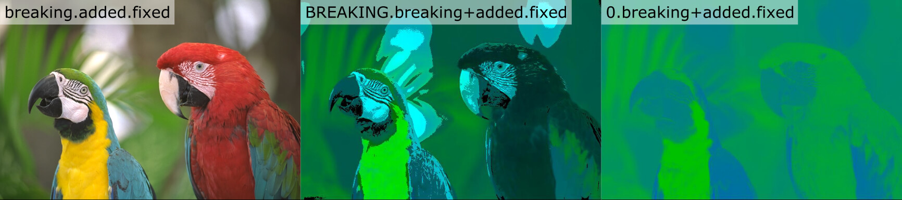

# version = f(changelog)

As a user, it's nice when a project has a changelog.  As a maintainer, it's a chore to keep the changelog up-to-date, and so many of us don't.  Unfortunately for maintainers, we can't opt-out from asking "Is this a big-enough change to justify a new major version?  Is this good enough for 1.0?"  But the "changelog" and "version" tasks are actually tightly coupled!

- **changelog**: what changed since the last version
- **version**: project these changes (and the absolute level of project quality) onto the three-dimensional vector space of non-negative integers `x.y.z`, path dependent on the previously published three-vector

That sounds silly, but it's not.  There are real cultural norms around what level of quality is required to call something `1.0`, what kind of a change is big enough to count as `2.0`, and how silly it would be to publish a `53.0`.  You could definitely train a neural net to approximate `version ≈ f(git)`, and the results would feel about right, but I bet the correlations would be surpising.  `0.x` might have less to do with stability than "were the commits made between 9am and 5pm local time".

## Risk, time, and effort

I own a bicycle, and my kid rides on the back seat every morning on the way to school.  It's just a bicycle, we don't go very fast, but I still care quite a bit about its safety.  If I gave this bike to a semver-compliant mechanic, they would say one of three things to me:

1. If you don't adjust the way you ride, you will crash.
2. You can ride it the same way, but I added some extra gears you can use if you want.
3. One of the bolts was loose, so I tightened it.

Obviously, (1) is a more important message than (2) or (3).  A more subtle distinction is that (2) has *more risk* than (3).  Even the best mechanics aren't perfect, and it's more likely that they made a mistake installing a whole new system than if they only tightened a loose bolt.  Regardless of the quality of my mechanic's work, the fact that (2) signals an opportunity for me to improve my ride inevitably means that I'm going to invest time and effort into exploring this new option, even if I end up not using it.

## From opinion to fact

For millenia, the way to describe temperature was: freezing, frigid, cold, warm, hot, boiling, melting. Even today, that's the scale that I use.  Does my kid need a jacket if it's 65°F?  I have no idea.  But if it's cold? Yes, they need a jacket if it's cold.

Around 1600[^1], Galileo notices that liquids expand ever so slightly with temperature[^1], and you can watch it happen if you put the liquid in a long skinny tube.  Sixty years later, somebody[^2] figures out to seal the tube so that you're only measuring temperature, and not pressure on accident.  Forty years after that Newton becomes the ward of the Royal Mint[^2a] and tries to define an absolute quantitative scale for the melting points of the metals used in coins.  He sticks the tube in melting snow and calls it zero, then sticks the tube in his armpit and calls it twelve (which is objectively better than ten[^2b]), and extrapolates from there.[^3]  Fifteen more years go by, and Fahrenheit figures out that mercury is better than Newton's linseed oil, and Americans like me will thank him for that accomplishment literally forever.

In retrospect, it's quite vain to think our armpits would be some godly universal constant.  Just one apex-predator-of-the-era earlier, Tyrannosaurus Newton would have had no such luck, but just such vanity.  Perhaps that's what kept the dinosaurs from...
&nbsp;&nbsp;&nbsp;&nbsp;&nbsp;&nbsp;I'm off-track.

The point is, our field is *young*.  The word ["changelog" hardly appears at all in the english language until 1990](https://books.google.com/ngrams/graph?content=changelog%2Cchange+log&case_insensitive=on&year_start=1880&year_end=2008&corpus=15&smoothing=3&share=&direct_url=t4%3B%2Cchangelog%3B%2Cc0%3B%2Cs0%3B%3BChangeLog%3B%2Cc0%3B%3Bchangelog%3B%2Cc0%3B%3BChangelog%3B%2Cc0%3B.t4%3B%2Cchange%20log%3B%2Cc0%3B%2Cs0%3B%3Bchange%20log%3B%2Cc0%3B%3BChange%20Log%3B%2Cc0%3B%3BChange%20log%3B%2Cc0%3B%3BCHANGE%20LOG%3B%2Cc0%3B%3Bchange%20Log%3B%2Cc0#t4%3B%2Cchangelog%3B%2Cc0%3B%2Cs0%3B%3BChangeLog%3B%2Cc0%3B%3Bchangelog%3B%2Cc0%3B%3BChangelog%3B%2Cc0%3B.t4%3B%2Cchange%20log%3B%2Cc0%3B%2Cs0%3B%3Bchange%20log%3B%2Cc0%3B%3BChange%20Log%3B%2Cc0%3B%3BChange%20log%3B%2Cc0%3B%3BCHANGE%20LOG%3B%2Cc0%3B%3Bchange%20Log%3B%2Cc0).  And dependency hell was restrained from its true inferno until MavenCentral came online in 2007[^4].  Just as Newton the mint-warden had a more practical interest in temperature than did Galileo the planet-looker, so too does Koçulu the left-padder have a more practical interest in changelogs than Torvalds the kernel-maker.  I very much doubt that we've yet found the final changelog / version convention!

<!-- Can make these display properly in GitHub with https://stackoverflow.com/a/29384216/1153071  -->
[1] [1592-3, to be more precise.](https://en.wikipedia.org/wiki/Timeline_of_temperature_and_pressure_measurement_technology#cite_note-1)
[2] [Ferdinand II, Grand Duke of Tuscany, in 1654.](https://en.wikipedia.org/wiki/Ferdinando_II_de%27_Medici,_Grand_Duke_of_Tuscany)
[2a] [DOnT pOlITicize sCiENcE.](https://en.wikipedia.org/wiki/Later_life_of_Isaac_Newton#Achievements_and_influence)
[^2aa] [ Ole Christensen Rømer did it at almost exactly the same time](https://en.wikipedia.org/wiki/Timeline_of_temperature_and_pressure_measurement_technology)
[2b] Join the [dozenal movement](http://www.dozenal.org/archive/ManualOfTheDozenSystem1174-web.pdf)!
[3] His paper in [the original Latin](https://www.td.mw.tum.de/fileadmin/w00bso/www/Forschung/Publikationen_Grigull/115.pdf), and [translated](https://en.wikipedia.org/wiki/Newton_scale).
[4] [The actual physical MavenCentral server!](https://blog.sonatype.com/2011/07/central-grows-up-see-the-history/#.Vo2mrxUrKUl)

## Your version can be a pure function of the changelog

Each morning, I look at my phone, and it tells me something like `high of 70°F, low of 50°F`.  And the problem is, I don't know what that feels like.  Does my kid need a jacket?  I have no idea, I gotta go outside and feel it.

So I get it, I get that "the mercury expanded X% so the temperature is Y" is less actionable than "it is cold, and you should put on a jacket".  But *every friggin morning* my spouse and I argue about the friggin jacket.  *ITS cOld oN ThE biKE*.

I don't want a Nest that shows me the temperature in °F, I want one of three pictures: kid in shorts, kid in pants, kid in jacket.  And that's it!  If the setpoints are off by 5°F, that's fine!  The kid will be fine!  If we notice a consistent problem, we can adjust the setpoints.  It's important to make a reasonable jacket decision, but **it doesn't have to be that precise, and it's hard to get a team (even a happily-married team!) to agree when we're arguing within the margin of error**. It's almost a tautology - of course you can't win an argument if the margin of error/subjectivity is bigger than the distance you're arguing over, and most of us are trying to win rather than agree within +/-ε.

The clincher is that although *versions* don't matter that much, *changelogs* absolutely do.  And there are a lot of projects in MavenCentral and NPM which have no changelogs, but every single one of them has versions.  It's the opposite of what you want!  The meaningful thing?  Optional.  The ambiguous, almost meaningless thing?  REQUIRED.  If there's only enough energy to do one thing, spend it all on the changelog! As Julius Caesar said at the RubyConf in 49BC: ***The changelog is cast, let the versions fall where they may.***

## It's trivial to implement

There is some disagreement over how to name the digits in `x.y.z`.  I'm going to use `BREAKING.ADDED.FIXED`.  If you're using the standard [keepachangelog](https://keepachangelog.com/en/1.0.0/) format, it is a trivial computation to turn a changelog into a version bump.

```
## [Unreleased]
### Added
- `foo()` can now accept `bar` as an input
- **BREAKING** you now have to call `fooInit()` before any call to `foo()`

## [3.1.4] - 2020-01-02
...
```

When it comes time to cut a release, just follow this algorithm:

- Find `\n## [Unreleased]`
- Scan from there until you find `\n## [x.y.z] - yyyy-mm-dd`
- Within that string that you just extracted
	- Can you find `**BREAKING**`?  If so, bump `BREAKING`.
	- Can you find `\n### Added`?  If so, bump `ADDED`.
	- Else, bump `FIXED`.

If you happen to be using the JVM, [Spotless Changelog](https://github.com/diffplug/spotless-changelog) has implemented this logic (and more) as a library and also as a gradle plugin.

## Pre-1.0, 0.x, and other forms of performative insecurity

As we just showed, one of the things your version can easily be is **(concise compatibility guarantee).(new-feature advertisement).(no-downside risk to upgrade)**, but that is an unpopular way for authors to pick their version. The most popular way to use the version string is to communicate that the author holds their code (or at least its public API) in low regard.  Across all of NPM[1]:

- 82% of packages are maintained by impostor syndrome people publishing as `0.x`
- 14% of packages are maintained by Dunning-Kruger people who publish as `1.x`
- 3% of packages are maintained by **engineers**, with a wide-spectrum of self-confidence, who nonetheless turn the crank and publish **(concise compatibility guarantee).(new-feature advertisement).(no-downside risk to upgrade)**

*If a library has a version, and no one depends on it, does it even have a version?*  Who cares!  But once someone has decided to use your library as a dependency, who cares how good *you* think it is.  *Your users* think that it's good!  Or at least *good enough*.  The terrible thing about `0.x` is that *the more unstable a codebase is, the more valuable **(concise compatibility guarantee).(new-feature advertisement).(lowest expected downside risk of upgrade)** would be!*

But popularity is what it is, and you're going to keep publishing things with `0.x`.  I will judge you for that, but [Spotless Changelog](https://github.com/diffplug/spotless-changelog) won't.  It will just increment the `ADDED` version (`0.1.0`, `0.2.0`, `0.3.0`, etc) whether your changelog has `**BREAKING**` or just `### Added`.  In terms of 3D vector space, this is *exactly* analagous to smashing an `R.G.B` image into `0.(R+G).B`.


But in terms of *information content*, it's far worse.  The `0.(R+G).B` transformation preserves intensity information, which is by far the most important signal in vision, human or otherwise.  To see the exact *perceptual* analogue, we have to go to the rg chromaticity space[2].


One actually good usecase for `0.x` is to make sure that the `publish` command is actually working.  But once you know that the publish is working, it's really time for `1.x`.  It's not a big deal!  This is how seriously you should take the `0.x` to `1.0` transition:


[1] [I guess the remaining 1% are maintained by, uh, rounding error?](http://npmbynumbers.bocoup.com).
[2] Technically, this is the "(rg)b chromaticity space", because we've made R and G indistinguishable from each other by mashing them together.  TODO: link to image-processing code.

## Your version can preserve your brand

After `0.x`, the second-most-popular way to use the breaking version is to communicate only the *big* breaking changes.  For example, if you made a material for building walls, you might call it `cement 1.0`.  You start adding rocks to it for extra strength (new feature!) so you call it `cement 1.1`.

[[cement image]]

A semver pedant would point out that `cement 1.0` was great at gluing things together, while `cement 1.1` is terrible at that, so you should bump the `breaking` version since it breaks some use cases.  But most people aren't semver pedants and they would agree that it doesn't break the *main* use case - it's only `breaking`, not `BREAKING`.

But then, you have a breakthrough!  You start pouring the cement into pre-formed blocks and it works great!  It works so great that your whole internal team which had been working on `cement 1.x` is now focused entirely on these new preformed blocks.  It's the next generation of build walls: `cement 2.0`!  Then, you figure out how to make these blocks cheaper and more environmentally fridendly: `cement 2.1`.  A few years later, your team invents a new connected-beam method, which lets people build higher than ever: `cement 3.0`!

[[cement to bricks to steel]]

Here is a true fact: *If you require your users to change the methods and tools that they use, some of them will keep using the old thing, and never switch to the new thing.*  This is true, and it is okay.  It is okay for you to abandon the old thing, and it is okay for other people to keep using it.  But once you release `cement 2.0` and put your marketing and leadership behind it, you severely damage the ability of your users to maintain and improve `cement 1.0` on their own.  You permanently break search and hashtags for your `1.x` hold outs, and even your `2.x` users will forever encounter weird non-sensical results at the bottom of their queries, forever.

If this is an intentional choice, then fine!  In 2015, the MacBook Pro had USB ports and a keyboard.  In 2016, it had neither[1].  They didn't call it `MacCpuAndScreen ButNoHumanOrUsbInputPro`.  And that's smart!  Apple has a strong opinion that humans should not type on laptops, and also that they should not plug USB devices into their laptops, and they are intentionally exercising their marketing and technical leadership to push us into the USB-C future[3].  They sure as heck don't want anyone selling retrofit kits for their new laptops, so why would they intentionally make it easy for people to talk about the old laptop versus the new one?

But if you're publishing an open source library where anybody can fork and contribute, why would you make this choice?  Why would you choose `brand_preservation_token.breaking+added.fixed` over `breaking.added.fixed`?  I think it's a misunderstanding of what a brand is.  **A brand is a sound with a human reputation**.  You've heard the spiel about apple the fruit vs Apple the brand, I don't have anything new to say about it.  But don't forget that **sounds compose**! You can combine them!  Don't "preserve" your brand, **grow** it!  Prefix it, suffix it, hyphenate it!  All of these operations preserve search and tagging. `CementBlocks 1.0`, `CementBlocks 2.0 (The Brick Series)`.    If you *really* want to go the "2" route, do it like this: `Cement2 1.0`.  At least that gives people a chance to tag things `#cement` vs `#cement2`.  But you really lose a lot of information with the `brand_preservation_token` thing, and you don't get much (anything?) in return.


## In summary

- Changelogs are more useful than versions.
- It is [easy to remove an unnecessary degree of freedom](https://github.com/diffplug/spotless-changelog) by setting `version = f(changelog)`.
- This constraint lets you ignore versions, which don't matter very much.
- This constraint will force your versions to have more information in them.
- This constraint will better conceal your embarrassing insecurity.
- This constraint may force you to *grow* the brand of your library rather than just *preserve* it.

## Acknowledgements 

- [Olivier Lacan](https://olivierlacan.com/) for inspiring a systematic approach with the [`keepachangelog`](https://keepachangelog.com/en/1.0.0/) project.
- [Stephan Bönnemann-Walenta](https://twitter.com/boennemann) for the excellent talk [We fail to follow SemVer - and why it needn't matter](https://www.youtube.com/watch?v=tc2UgG5L7WM&feature=youtu.be&t=275).
- [bocoup](https://bocoup.com/) for the very interesting [npm by numbers](http://npmbynumbers.bocoup.com/).
- TODO: image licenses